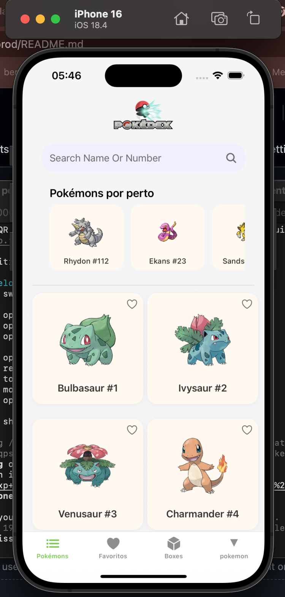
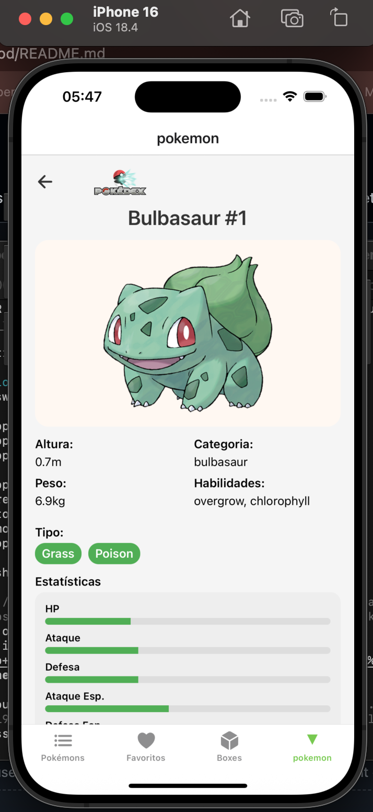
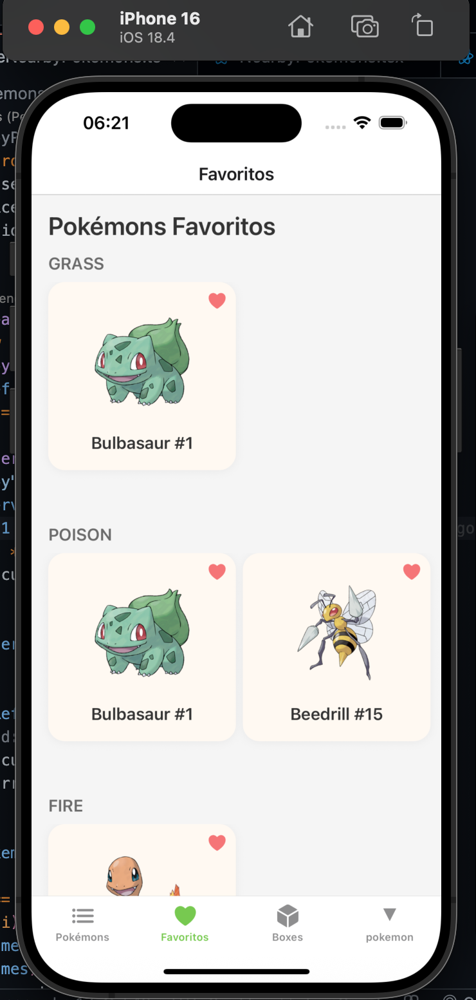
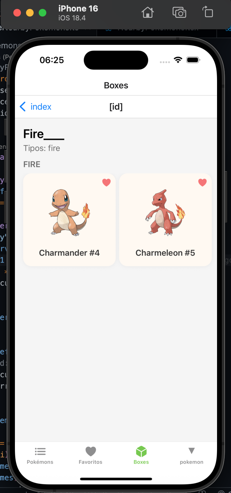
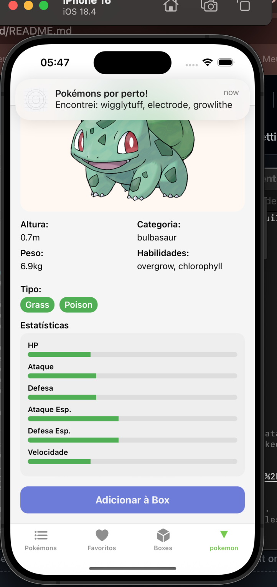

# 📱 Pokedéx App

Aplicativo mobile desenvolvido em React Native com Expo, que permite visualizar, buscar, favoritar e organizar Pokémons em Boxes personalizadas. Notificacoes aparecem no topo da tela quando Pokémons aparecem por perto.

---

## 🚀 Funcionalidades

* 🔍 Buscar Pokémons por nome ou número
* ❤️ Favoritar Pokémons
* 📦 Criar Boxes com tipos definidos
* ➕ Adicionar/remover Pokémons nas Boxes
* 📍 Seção de Pokémons por perto (com notificação)
* 🔔 Notificações locais usando `expo-notifications`
* 💾 Persistência com `AsyncStorage`
* 🌐 Imagens oficiais em alta resolução
* 🧼 UI seguindo design do Figma (modo grid responsivo)

---

## ▶️ Demonstração em vídeo

▶️ [Clique aqui para assistir à demonstração do app](https://drive.google.com/file/d/1_Y0pZ5-uMihz4wquIFKFCrK0kgTxEaEM/view?usp=sharing)

---

## 📸 Screenshots

| Tela Inicial                | Detalhes                    | Favoritos                   | Boxes                       |  Add PC box                                   |
| --------------------------- | --------------------------- | --------------------------- | --------------------------- | ----------------------------------- |
|  |  |  |  |  |                           |

---

## 🧠 Design feito no figma

▶️ [Clique aqui para ver o design no figma](https://www.figma.com/design/ygxXxbzVov0mS3BQlwaFv5/Untitled?node-id=0-1&t=dCymtDfgUzldBy47-1)

---

## 🧠 Arquitetura

Aplicado **Clean Architecture**:

```
src/
├── components/       # Componentes visuais reutilizáveis
├── context/          # Context API e serviços globais
├── data/             # Repositórios e fontes de dados
│   ├── datasources/
│   └── repositories/
├── domain/           # Modelos e tipos do domínio
├── services/         # Serviços externos (notificações)
├── theme/            # Estilos, tokens, espaçamentos
├── viewmodels/       # Lógica de tela (hooks)
```

---

## 🧪 Testes

```bash
npm test
```

* ✅ `FavoriteRepository.test.ts`
* ✅ `PCBoxRepository.test.ts`
* ⏳ Testes adicionais podem ser implementados com `@testing-library/react-native` e `jest-expo`.

---

## 📦 Instalação

```bash
git clone https://github.com/PedroNestJp/pockedex-expo-app.git
cd pockedex-expo-app
npm install
npx expo start
```

> 💡 Certifique-se de aceitar permissões de notificação no dispositivo.

---

## 📱 Tecnologias

* React Native (com Expo SDK)
* TypeScript
* AsyncStorage
* Expo Notifications
* React Query
* React Navigation (expo-router)
* @testing-library + Jest

---

## 📄 Licença

Este projeto é apenas para fins de demonstração técnica.

---

## ✨ Autor

Desenvolvido por **Pedro Silva** 💻
[LinkedIn](https://www.linkedin.com/in/pedronest)
